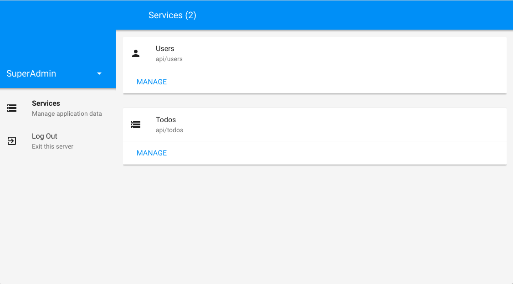

# admin

An automatic admin panel for Angel applications.
This admin is **not production ready**, as it makes no
provisions for security (yet!).

This project is in its very early stages; expect frequent changes and breakages.

# Planned Features
* [x] User Profiles
    * Enable you to authenticate as a user (i.e. admin) without logging in
* [ ] Service Manager
    * Table-based data manager for any service
    * (Database-agnostic automatically :smile:)
    * [ ] Inputs
        * [ ] Text
        * [ ] TextArea
        * [ ] Number
        * [ ] Date
        * [ ] DateTime
        * [ ] Selects
            * [ ] Static Selects
            * [ ] Selects that reference other services
                * i.e. "Pick a category"
        * [ ] File Upload (via [Dropzone.js](http://www.dropzonejs.com/))
        * [ ] [Quill.js](https://quilljs.com/) support
* [ ] Graphs
* [ ] Application-wide singletons
    * Manage singleton values that are synchronized with every instance of
      your application
* [ ] Logging view
* [ ] Crash reporting
* [ ] Status Report
    * [ ] View which instances are running, or have crashed (and why)
    * [ ] Restart/kill instances
    * [ ] Link to Observatory
* [ ] Custom pages
* And more...?
